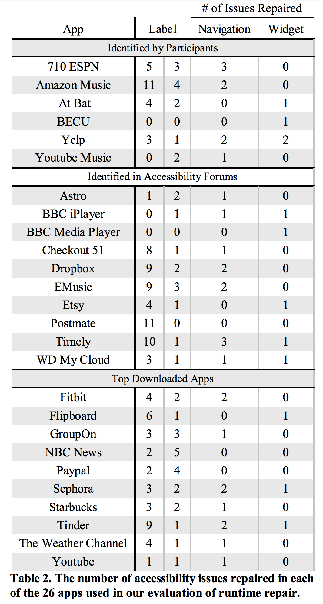

# RobustAnnotation
Robust Annotation of Mobile Application Interfaces in Methods for Accessibility Repair and Enhancement

Supplementary Table for Page 10: The detail of the accessibility issues we repaired in total of 26 apps.
